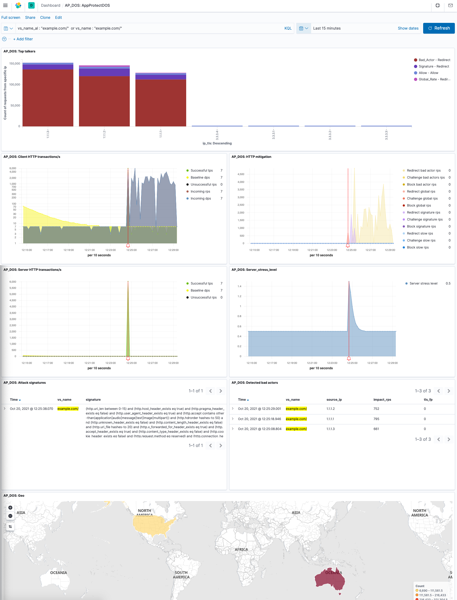

# NGINX App Protect DoS ELK Dashboards
A community supported repo for NGINX App Protect Denial of Service dashboards on the ELK stack.



## How does it work?
ELK stands for Elasticsearch, Logstash, and Kibana. Logstash receives logs from NGINX App Protect DoS, normalizes them and stores them in the Elasticsearch index. Kibana allows you to visualize and navigate through logs using purpose built dashboards.

## Requirements
- The installation instructions assume you are using a bash or zsh shell. The [Docker](https://docker.com), [docker-compose](https://docs.docker.com/compose/) and [jq](https://stedolan.github.io/jq/) packages are also assumed to be installed.

- The provided Kibana dashboards require a minimum version of 7.9.3. If you are using the provided [docker-compose.yaml](docker-compose.yaml) file, this version requirement is met.

- In `docker-compose.yaml`, the subnet configuration is added in order to override the ip assignment from the Docker default subnet, i.e 172.18.x.x/16. 
```
...
networks:
  default:
    ipam:
      driver: default
      config:
        - subnet: 172.33.0.0/16
```
- In case there is an error creating the docker network, restart docker: `systemctl restart docker`.

- The ELK stack docker container will likely exceed the default host's virtual memory system limits. Use [these directions](https://www.elastic.co/guide/en/elasticsearch/reference/5.0/vm-max-map-count.html#vm-max-map-count) to increase this limit on the docker host machine. If you do not, the ELK container will continually restart itself and never fully initialize.

## Installation Overview
It is assumed you will be running ELK using the Quick Start directions below. The template in `logstash/conf.d` will create a new Logstash pipeline to ingest logs and store them in Elasticsearch. If you use the supplied `docker-compose.yaml`, this template will be copied into the docker container instance for you. Once the DoS logs are being ingested into the Elasticsearch index, you will need to import files from the [kibana](kibana/) folder to create all necessary objects including the index pattern, visualization and dashboards.


### Deploying ELK Stack
1. Use docker-compose to deploy your own ELK stack.

```shell
docker-compose -f docker-compose.yaml up -d
```

2. Verify the installation by logging into Kibana via a browser at `http://< your container host>:5601/`

**NOTE**
- It assumed that your current working directory is `nap-dos-elk-dashboards`. This name (with dashes removed) will be automatically prepended to the name of the ELK docker container, and is assumed in the instructions below.
- The `logstash` folder will be created in the working directory.
- The `logstash/conf.d` folder is mapped to `/etc/logstash/conf.d` in the ELK container.


3. Open a new terminal window and ssh into the container:

```shell
docker exec -it napdoselkdashboards_elasticsearch_1 /bin/bash
```

4. From inside the container, stop the `logstash` process:

```shell
service logstash stop
```

5. Install Logstash plugins :

```shell
/opt/logstash/bin/logstash-plugin install logstash-output-syslog
/opt/logstash/bin/logstash-plugin install logstash-input-syslog
/opt/logstash/bin/logstash-plugin install logstash-input-tcp
/opt/logstash/bin/logstash-plugin install logstash-input-udp
```

6. Print the contents of the Logstash configuration file to ensure it exists:

```shell
cat /etc/logstash/conf.d/apdos-logstash.conf
```

7. From outside the container, create the Elasticsearch index with the following cURL command:

```shell
curl -XPUT "http://localhost:9200/app-protect-dos-logs"  -H "Content-Type: application/json" -d  @apdos_mapping.json
```

**NOTE**
In case there is error in this step, it may indicate that the `app-protect-dos-logs` index already exists from a previous Kibana installation, or has been created automatically by Logstash processing incoming App Protect DoS messages. If so, you will need to delete the index with the following cURL command:

```shell
curl -XDELETE http://localhost:9200/app-protect-dos-logs
```

To verify that `app-protect-dos-logs` index has been deleted:

```shell
curl -XGET "http://localhost:9200/_cat/indices"
```

The result should not include an `app-protect-dos-logs` index. Then, re-attempt to create the index using the instructions in the step above.


8. Update mapping with geo fields:

```shell
curl -XPOST "http://localhost:9200/app-protect-dos-logs/_mapping"  -H "Content-Type: application/json" -d  @apdos_geo_mapping.json
```

9. Import dashboards to Kibana through the UI (Kibana -> Management -> Saved Objects) or alternatively, use API call below:

```shell

KIBANA_CONTAINER_URL=http://localhost:5601

jq -s . kibana/apdos-dashboard.ndjson | jq '{"objects": . }' | \
curl -k --location --request POST "$KIBANA_CONTAINER_URL/api/kibana/dashboards/import" \
    --header 'kbn-xsrf: true' \
    --header 'Content-Type: text/plain' -d @- \
    | jq

```

10. Start Logstash from inside the container:

```shell
service logstash start
```

### NGINX App Protect Configuration
NGINX App Protect DoS configuration directives as should appear in your `nginx.conf`. You will need to replace `ip_kibana` in the snippet below with the hostname of the server hosting your ELK Docker container:

```
http {
    log_format log_dos ', vs_name_al=$app_protect_dos_vs_name, ip=$remote_addr, outcome=$app_protect_dos_outcome, reason=$app_protect_dos_outcome_reason, ';
    ...
    server {
       ...

       app_protect_dos_security_log_enable on;
       app_protect_dos_security_log "/etc/app_protect_dos/log-default.json" syslog:server=ip_kibana:5261;


       location / {
           app_protect_dos_enable       on;
           set $loggable '0';
           access_log syslog:server=ip_kibana:5561 log_dos if=$loggable;

        ...   
       }
       
    }
    ...
}
```

**NOTE**
The Logstash listener in this solution is configured to listen for TCP syslog messages on port `5261` and UDP port `5561`. Kibana and Elasticsearch are using TCP ports `9200`, `5601` respectively.
These ports must be opened on your firewall for TCP/UDP accordingly.


## Distinguishing services in the case of multiple protected objects (vss)

Using the dashboard filter:
As an example, for protected object name "example.com", the filter should be as follows:
`vs_name_al : "example.com/"  or vs_name : "example.com/"`

**NOTE**
`vs_name_al` and `vs_name` must be both at dashboard filter level, and be connected with: "or".

